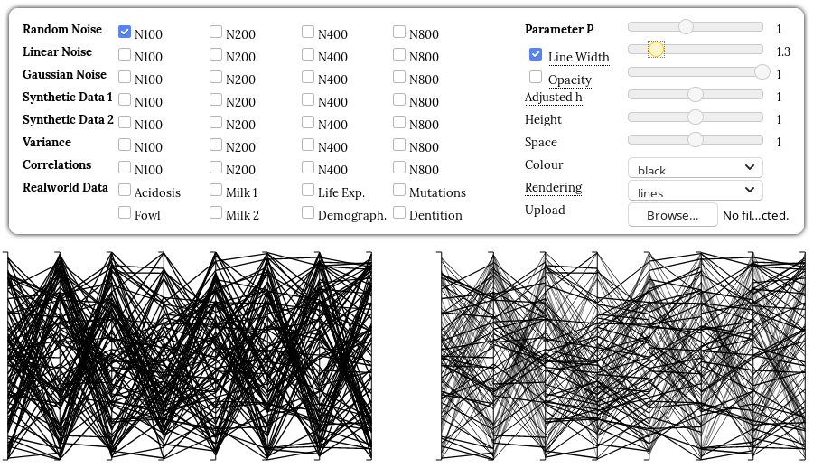

# Slope-Dependent Rendering of Parallel Coordinates to Reduce Density Distortion and Ghost Clusters

This is the supplementary material for: 

> David Pomerenke, Frederik L. Dennig, Daniel A.Keim, Johannes Fuchs, Michael Blumenschein.
Slope-Dependent Rendering of Parallel Coordinates to Reduce Density Distortion and Ghost Clusters. 
IEEE Conference on Information Visualization 2019. 
[[ArXiv]](https://arxiv.org/abs/1908.00500)

## Online Prototype

To test the effect of our adjustment technique, we have implemented a testing tool. 
The tool offers many synthetic and real world data sets for display, as well as the possibility to add own datasets. It allows to continuously manipulate parameter P and compare the effect to standard PCP renderings. 
It is also possible to manipulate all other relevant parameters, namely the adjusted constant line width factor h, opacity, axis height, axis spacing, line colour, and rendering technique.

### Starting the tool

#### Online

The tool is available at [davidpomerenke.github.io/slope](https://davidpomerenke.github.io/slope). 
Note that adding own datasets is currently unsupported by the online version. 

#### Local

A local webserver has to be started as local file loading is disabled in browsers for security reason. One option is Python:

Navigate inside the main directory (which includes the _index.html_ ) and execute:

    python -m http.server

Then you can access the tool from the URL displayed, which is usually [localhost:8000](https://localhost:8000).

### Usage

On the left side, the regular PCPs (including distortion and ghost clusters) are displayed. 
On the right side, our slope-dependent adjustment technique can be applied to either line width (default and recommended) or opacity (experimental) by checking the respective boxes. In either case, _parameter P_ determines the strength of the effect and is also only applied to the right-hand PCP.
_Adjusted h_ refers to a constant line height factor, which is also only applied to the PCP on the right.

The other parameters are the constant parts of line width and line opacity, the height and spacing of the axes and the colour, including a multi-colour option to easily identify the clusters. 
All these parameters apply to the PCPs on both sides.

Rendering can be switched to rendering lines as polygonal parallelograms.
In this case, parameter P has no effect any longer.

### Add own datasets

Own datasets can be uploaded in the tool. 
Files must be in _csv_-format with an optional header and numeric columns. 
An optional column _cluster_ in the _csv_-file may be used for the multi-colour display option.

## Data Generation
The data files have been created with _data-generation.r_. 
The real-world datasets are from R ’s [cluster.datasets](https://cran.r-project.org/package=cluster.datasets) package.